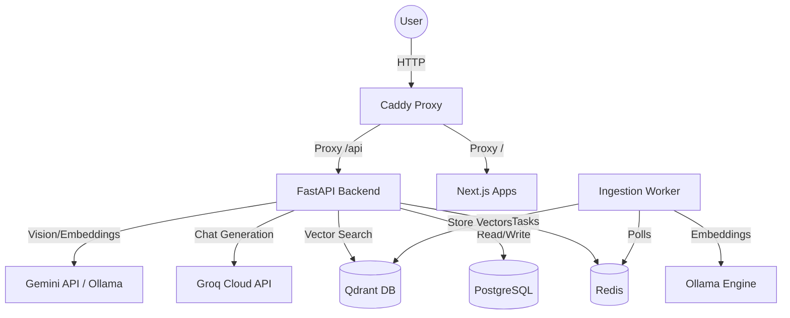

# Project Nexus 

**Nexus** is a high-performance, on-premise Retrieval-Augmented Generation (RAG) system designed for the **Department of Artificial Intelligence & Machine Learning, DSCE**. It provides a secure, intranet-only knowledge base where users can interact with institutional documents via a conversational AI interface.

## Project Goals
- **Privacy First**: Ensure that sensitive institutional data never leaves the on-premise environment.
- **Hybrid Intelligence**: Combine the speed of cloud LLMs (Groq) with the reliability of local embeddings (Ollama).
- **Enterprise Grade**: Built for scalability with a distributed architecture using Redis and Qdrant.

## Architecture

### System Design
Nexus follows a decoupled microservices architecture to ensure high availability and scalability.

### Architectural Decisions

#### 1. Dual-Deployment Strategy (Local + Docker)
To facilitate both rapid development and stable production, Nexus supports two deployment modes:
- **Docker Mode**: A fully containerized stack using `docker-compose`, ideal for production deployments where environment consistency is critical.
- **Native Local Mode**: A lightweight execution mode using `uvicorn` and `npm`, allowing developers to run the system without the overhead of Docker.

#### 2. Hybrid LLM Pipeline
We employ a "Best-of-Breed" approach to LLMs:
- **Generation**: Groq API is used for its industry-leading tokens-per-second, ensuring a seamless chat experience.
- **Embeddings**: Local Ollama (`nomic-embed-text`) is used to keep the core indexing process on-premise, reducing latency and cost.
- **Vision**: Google Gemini is utilized for complex image/chart analysis.

#### 3. Asynchronous Ingestion
Document processing is handled by a dedicated background worker. This ensures that uploading large magazines or PDFs doesn't block the API, allowing for a responsive administrative experience.

## Quick Start

### Deployment Options
- For local development: See [LOCAL_RUN.md](LOCAL_RUN.md)
- For on-prem production: See [DOCKER_DEPLOYMENT.md](DOCKER_DEPLOYMENT.md)

## Tech Stack
- **Backend**: Python, FastAPI, SQLAlchemy, AsyncPG
- **Frontend**: Next.js, React, Tailwind CSS
- **Databases**: PostgreSQL (Metadata), Qdrant (Vectors), Redis (Queue/Cache)
- **LLMs**: Groq, Google Gemini, Ollama
- **Infrastructure**: Docker, Caddy

## Institutional Focus
Nexus is tailored for the AI & ML Department at DSCE, focusing on:
- **Secure Intranet**: Access restricted to campus networks.
- **Role-Based Access**: Different visibility levels (Generic, Internal, Restricted) for documents.
- **Citation-Backed Answers**: Every response is grounded in ingested documents with precise page/sheet citations.
